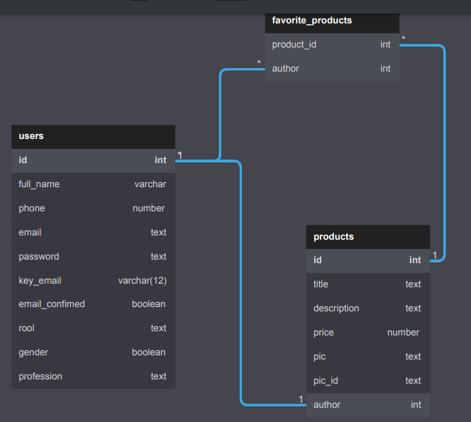

# SERVER Store app

## Database design



More details: <a href="./src/assets/store_app_diagram.pdf">PDF design</a>

# End Pints

## Get All Users

```js
const getAllUsers = async () => {
	const url = 'http://example.com/api/users/all';
	const request = await fetch(url); // method: GET
	const response = await request.json();
	return response;
};
```

## Create New User

```js
const createNewUser = async () => {
	const url = 'http://example.com/api/auth/signup';
	const request = await fetch(url, {
		method: 'POST',
		headers: {
			'Content-type': 'application/json',
		},
		body: JSON.stringify({
			email: 'user@email.com',
			password: 'userpassword',
			full_name: 'Jhon Doe',
		}),
	});
	const response = await request.json();
	return response;
};
```

## Register User

```js
const registerUser = async () => {
	const url = 'http://example.com/api/auth/signin';
	const request = await fetch(url, {
		method: 'POST',
		headers: {
			'Content-type': 'application/json',
		},
		body: JSON.stringify({
			email: 'user@email.com',
			password: 'userpassword',
		}),
	});
	const response = await request.json();
	return response;
};
```

## Edit User Info

```js
const editUser = async () => {
	const url = 'http://example.com/api/users/edit';
	const request = await fetch(url, {
		method: 'PATCH',
		headers: {
			'Content-type': 'application/json',
            token: 'your token'
		},
		body: JSON.stringify({
        	phone: '',
		    full_name: '',
		    profession: ",
		    gender: true || false;
        }),
	});
	const response = await request.json();
	return response;
};
```

## Remove User

```js
const removeUser = async () => {
	const url = 'http://example.com/api/users/remove';
	const request = await fetch(url, {
		method: 'DELETE',
		headers: {
			'Content-type': 'application/json',
			token: 'your token',
		},
		body: JSON.stringify({
			password: 'user password',
		}),
	});
	const response = await request.json();
	return response;
};
```

# Products

## Get all products

```js
const getAllProducts = async () => {
	const url = 'http://localhost:8000/api/products/all';
	const request = await fetch(url); // method GET
	const response = await request.json();
	return response;
};
```

## Create products

```js
const createNewProduct = async () => {
	// to upload images it is advisable to use AXIOS
	const url = 'http://localhost:8000/api/products/create';
	const request = await fetch(url, {
		method: 'POST',
		headers: {
			'Content-type': 'application/json',
            'Content-type': "multipart/form-data",// to be able to upload files
            'token': "your token"
		},
		body: JSON.stringify({
			title: 'user@email.com',
			description: 'userpassword',
			price: 'userpassword',
			product_pic: //your image,
		}),
	});
	const response = await request.json();
	return response;
};
```

## Delete products

```js
const createNewProduct = async () => {
	// only admins can drop products
	const url = `http://localhost:8000/api/products/drop/${id_product}`;
	const request = await fetch(url, {
		method: 'DELETE',
		headers: {
			token: 'your token',
		},
	});
	const response = await request.json();
	return response;
};
```

## Add favorites products

```js
const addFavoriteProduct = async () => {
	// all users can add favorite products
	const url = `http://localhost:8000/api/products/favorites/add/${id_product}`;
	const request = await fetch(url, {
		method: 'GET',
		headers: {
			token: 'your token',
		},
	});
	const response = await request.json();
	return response;
};
```

## Get Favorite products by user id

```js
const getFavoriteProductsByUser = async () => {
	const url = `http://localhost:8000/api/products/favorites`;
	const request = await fetch(url, {
		method: 'GET',
		headers: {
			token: 'your token',
		},
	});
	const response = await request.json();
	return response;
};
```

## Remove Favorite products

```js
const removeFavoriteProductsByProductId = async () => {
	const url = `http://localhost:8000/api/products/favorites/remove/${id_product}`;
	const request = await fetch(url, {
		method: 'DELETE',
		headers: {
			token: 'your token',
		},
	});
	const response = await request.json();
	return response;
};
```

## Remove products 

```js
const removeProductsByProductId = async () => {
	const url = `http://localhost:8000/api/products/drop/${id_product}`;
	const request = await fetch(url, {
		method: 'DELETE',
		headers: {
			token: 'your token',
		},
	});
	const response = await request.json();
	return response;
};
```


